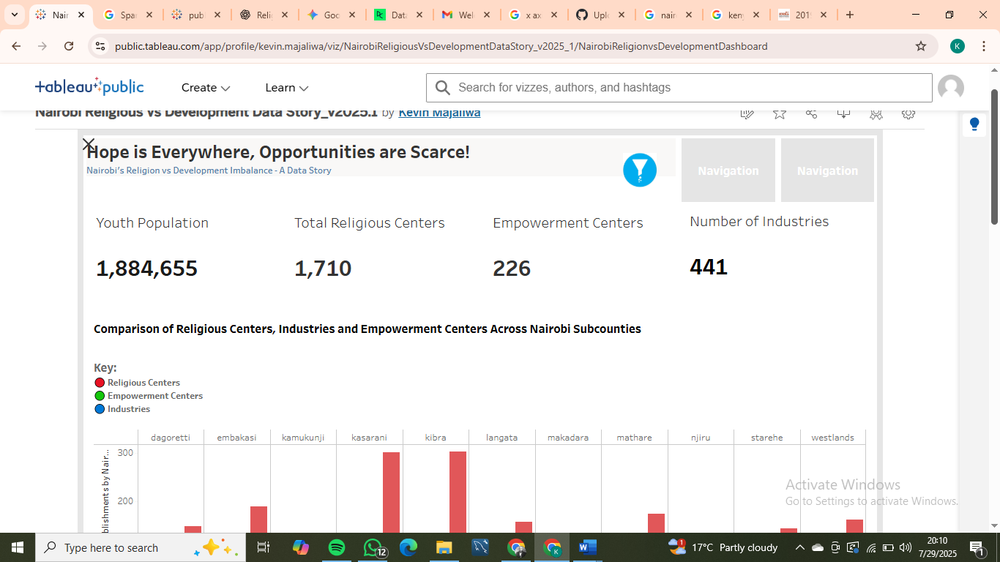

# Nairobi Youth Development & Opportunity Imbalance: A Data Story

## Project Overview

This project explores the relationship between religious center density—industries and empowermwnt centers and youth population across sub-counties in Nairobi, Kenya. It aims to visualize and analyze the disparities, particularly focusing on the apparent imbalance where "hope" represented by religious centers is everywhere, but opportunities represented by industries and empowerment centers are "scarce" for the youth which suggest an underinvestment in critical development sectors compared to religious infrastructure.

**Explore the full interactive dashboard on Tableau Public here:**
[Dashboard](https://public.tableau.com/shared/BNY5TQCMY?:display_count=n&:origin=viz_share_link)

## Data Sources

The analysis is based on data gathered from various sources:
* **Religious Centers:** Scraped data of religious institutions (churches, mosques, temples etc) from OpenStreetMap using overpass-turbo API across Nairobi sub-counties.
```overpassql
[out:json][timeout:180];
area["name"="Nairobi"]["boundary"="administrative"]->.searchArea;

(
  // All places explicitly tagged as place_of_worship
  node["amenity"="place_of_worship"](area.searchArea);
  way["amenity"="place_of_worship"](area.searchArea);
  relation["amenity"="place_of_worship"](area.searchArea);

  // Places with names that imply religion
  node["name"~"church|worship|faith|religious|temple|mosque|shrine|synagogue|pcea|anglican|catholic|sda|islam|hindu|jesus", i](area.searchArea);
  way["name"~"church|worship|faith|religious|temple|mosque|shrine|synagogue|pcea|anglican|catholic|sda|islam|hindu|jesus", i](area.searchArea);
  relation["name"~"church|worship|faith|religious|temple|mosque|shrine|synagogue|pcea|anglican|catholic|sda|islam|hindu|jesus", i](area.searchArea);
);

out center;
```

* **Industries & Institutions:** Scraped data for formal industries, and empowerment/vocational training centers from OpenStreetMap via Overpass turbo API.
```overpassql
[out:json][timeout:180];
area["name"="Nairobi"]["boundary"="administrative"]->.searchArea;
(
  node(area.searchArea)["landuse"="industrial"];
  way(area.searchArea)["landuse"="industrial"];
  relation(area.searchArea)["landuse"="industrial"];

  node(area.searchArea)["man_made"="works"];
  way(area.searchArea)["man_made"="works"];
  relation(area.searchArea)["man_made"="works"];

  node(area.searchArea)["man_made"="factory"];
  way(area.searchArea)["man_made"="factory"];
  relation(area.searchArea)["man_made"="factory"];

  node(area.searchArea)[name~"industry|factory|manufacturing",i];
  way(area.searchArea)[name~"industry|factory|manufacturing",i];
  relation(area.searchArea)[name~"industry|factory|manufacturing",i];
);
out center;
```


* **Youth Population:** Used Kenya National Bureau of Statictics (KNBS) census 2019 data of youth population data (ages 15-35) per Nairobi sub-county. [KNBS website](https://www.knbs.or.ke/reports/kenya-census-2019/)
* **Geospatial Data:** Sub-county boundaries of Nairobi for mapping.

## Methodology

1.  **Data Acquisition:**
   - Utilized web scraping techniques to collect raw data on various establishments.
   - Aggregated Nairobi youth population from KNBS 2019 census as per sub-county boundary data.
2. **Data Cleaning & Preprocessing**
   - **Initial Cleaning:** Performed extensive data cleaning in **Microsoft Excel** using various functions such as TRIM(), CONCATENATE(), UPPER(), LOWER(), REMOVE DUPLICATES Tool, Data Validation, Filter & Advanced Filter to handle inconsistencies, missing values, and formatting issues which is inherent in scraped data.
   - **Transformation & Aggregation:** Utilized **SQL (Structured Query Language)** for more complex data transformations and aggregations such as counting centers per sub-county, calculating ratios per 10,000 youth), and merging disparate datasets. This ensured handling messy data and ensuring data integrity.
3. **Data Analysis & Feature Engineering:**
     - Calculated key metrics such as "Religious Centers per 10,000 Youth," "Development Centers (Industries + Institutions) per 10,000 Youth.
```SQL
--Industries, Religion, Industries per 10 000 youth
SELECT p.subcounty,
    COALESCE(
        (ind.num_industries / p.total_youth_pop) * 10000,
        0
    ) AS industries_per_10k_youth,
    COALESCE(
        (rel.num_religious_centers / p.total_youth_pop) * 10000,
        0
    ) AS religious_centers_per_10k_youth,
    COALESCE(
        (inst.num_institutions / p.total_youth_pop) * 10000,
        0
    ) AS institutions_per_10k_youth
FROM
    (SELECT subcounty, SUM(youth_pop) AS total_youth_pop FROM population GROUP BY subcounty) AS p
LEFT JOIN
    (SELECT subcounty, COUNT(company_name) AS num_industries FROM industries GROUP BY subcounty) AS ind
    ON p.subcounty = ind.subcounty
LEFT JOIN
    (SELECT subcounty, COUNT(name) AS num_religious_centers FROM religion GROUP BY subcounty) AS rel
    ON p.subcounty = rel.subcounty
LEFT JOIN
    (SELECT subcounty, COUNT(institution) AS num_institutions FROM institutions GROUP BY subcounty) AS inst
    ON p.subcounty = inst.subcounty
WHERE
    p.total_youth_pop > 0;
```
  - Categorized sub-counties into "High Development" and "Low Development" using Tableau calculated field function based on defined thresholds to reveal disparities in youth opportunities.

## Data Visualization (Tableau)

- Designed and built an interactive dashboard in **Tableau Public** to visually represent the findings.
  
- Developed key performance indicators (KPIs) to highlight total counts.
- Created comparative bar charts to show relative distribution across sub-counties.
- Implemented scatter plots to analyze relationships (e.g., religious centers vs. development centers).
- Integrated a choropleth map for spatial distribution.
- **Dashboard Features:** Appllied filters i.e Sub-county affecting all charts, KPIs, and included clear legends for visual interpretation.
- **Challenge Highlight:** *Overcomed initial hurdles with KPI display cutoff numbers, duplicate labels in Tableau Public's web interface, demonstrating adaptability and problem-solving in data visualization.*


