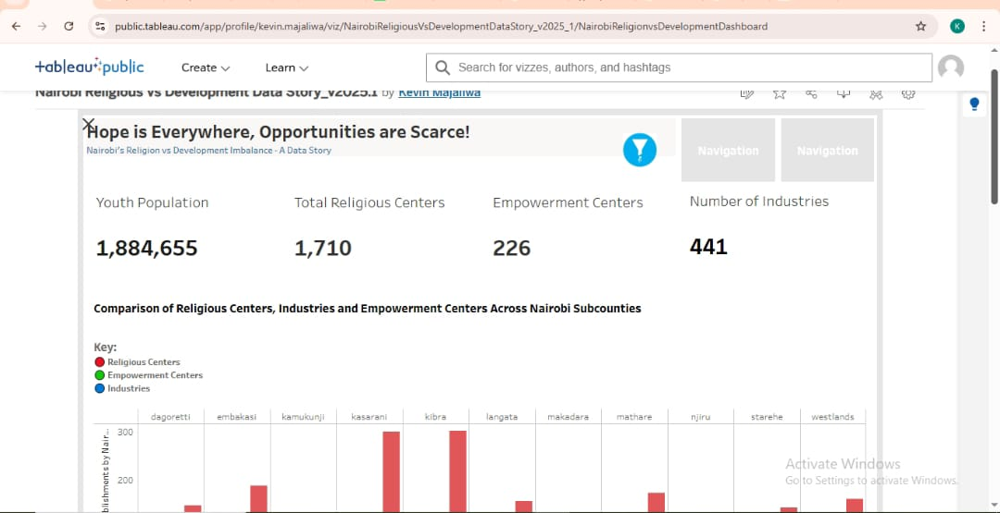

# Nairobi Youth Development & Opportunity Imbalance: A Data Story

## Table of Contents
- [Project Overview](#project-overview)
- [Data Sources](#data-sources)
- [Methodology](#methodology)
- [Data Visualization](#data-visualization-tableau)
- [Key Insights](#key-insights)
- [Tools & Technologies Used](#tools--technologies-used)
- [Limitations](#limitations)
- [Recommendations](#recommendations)
- [Future Work](#future-work)
- [Definition of Terms](#definition-of-terms)

## Project Overview

This project explores the relationship between religious center density—industries and empowermwnt centers and youth population across sub-counties in Nairobi, Kenya. It aims to visualize and analyze the disparities, particularly focusing on the apparent imbalance where "hope" represented by religious centers is everywhere, but opportunities represented by industries and empowerment centers are "scarce" for the youth which suggest an underinvestment in critical development sectors compared to religious infrastructure.

**Explore the full interactive dashboard on Tableau Public here:**
[Dashboard](https://public.tableau.com/shared/BNY5TQCMY?:display_count=n&:origin=viz_share_link)

## Data Sources

The analysis is based on data gathered from various sources:
* **Religious Centers:** Scraped data of religious institutions (churches, mosques, temples etc) from OpenStreetMap using overpass-turbo API across Nairobi sub-counties.
```overpassql
[out:json][timeout:180];
area["name"="Nairobi"]["boundary"="administrative"]->.searchArea;

(
  // All places explicitly tagged as place_of_worship
  node["amenity"="place_of_worship"](area.searchArea);
  way["amenity"="place_of_worship"](area.searchArea);
  relation["amenity"="place_of_worship"](area.searchArea);

  // Places with names that imply religion
  node["name"~"church|worship|faith|religious|temple|mosque|shrine|synagogue|pcea|anglican|catholic|sda|islam|hindu|jesus", i](area.searchArea);
  way["name"~"church|worship|faith|religious|temple|mosque|shrine|synagogue|pcea|anglican|catholic|sda|islam|hindu|jesus", i](area.searchArea);
  relation["name"~"church|worship|faith|religious|temple|mosque|shrine|synagogue|pcea|anglican|catholic|sda|islam|hindu|jesus", i](area.searchArea);
);

out center;
```

* **Industries & Institutions:** Scraped data for formal industries, and empowerment/vocational training centers from OpenStreetMap via Overpass turbo API.
```overpassql
[out:json][timeout:180];
area["name"="Nairobi"]["boundary"="administrative"]->.searchArea;
(
  node(area.searchArea)["landuse"="industrial"];
  way(area.searchArea)["landuse"="industrial"];
  relation(area.searchArea)["landuse"="industrial"];

  node(area.searchArea)["man_made"="works"];
  way(area.searchArea)["man_made"="works"];
  relation(area.searchArea)["man_made"="works"];

  node(area.searchArea)["man_made"="factory"];
  way(area.searchArea)["man_made"="factory"];
  relation(area.searchArea)["man_made"="factory"];

  node(area.searchArea)[name~"industry|factory|manufacturing",i];
  way(area.searchArea)[name~"industry|factory|manufacturing",i];
  relation(area.searchArea)[name~"industry|factory|manufacturing",i];
);
out center;
```


* **Youth Population:** Used Kenya National Bureau of Statictics (KNBS) census 2019 data of youth population data (ages 15-35) per Nairobi sub-county. [KNBS website](https://www.knbs.or.ke/reports/kenya-census-2019/)
* **Geospatial Data:** Sub-county boundaries of Nairobi for mapping.

## Methodology

1.  **Data Acquisition:**
* Utilized web scraping techniques to collect raw data on various establishments.
* Aggregated Nairobi youth population from KNBS 2019 census as per sub-county boundary data.
2.  **Spatial Data Assignment (GeoJSON Mapping with Python)**

While the scraped data contained only longitude and latitude coordinates, it was essential to assign each point (religious centers, industries, institutions) to their respective Nairobi subcounties.

To achieve this:
i. I obtained a [GeoJSON file]() with Nairobi subcounty polygon boundaries.
ii. Using **Python scripts**, I performed a **Point-in-Polygon spatial join**, mapping each lat/lon coordinate to its corresponding subcounty.
iii. This process ensured every facility was accurately categorized under its administrative subcounty, enabling precise aggregation and visualization.
  
3. **Data Cleaning & Preprocessing**
   - **Initial Cleaning:** Performed extensive data cleaning in **Microsoft Excel** using various functions such as TRIM(), CONCATENATE(), UPPER(), LOWER(), REMOVE DUPLICATES Tool, Data Validation, Filter & Advanced Filter to handle inconsistencies, missing values, and formatting issues which is inherent in scraped data.
   - **Transformation & Aggregation:** Utilized **SQL (Structured Query Language)** for more complex data transformations and aggregations such as counting centers per sub-county, calculating ratios per 10,000 youth), and merging disparate datasets. This ensured handling messy data and ensuring data integrity.
4. **Data Analysis & Feature Engineering:**
     - Calculated key metrics such as "Religious Centers per 10,000 Youth," "Development Centers (Industries + Institutions) per 10,000 Youth.
```SQL
--Industries, Religion, Industries per 10 000 youth
SELECT p.subcounty,
    COALESCE(
        (ind.num_industries / p.total_youth_pop) * 10000,
        0
    ) AS industries_per_10k_youth,
    COALESCE(
        (rel.num_religious_centers / p.total_youth_pop) * 10000,
        0
    ) AS religious_centers_per_10k_youth,
    COALESCE(
        (inst.num_institutions / p.total_youth_pop) * 10000,
        0
    ) AS institutions_per_10k_youth
FROM
    (SELECT subcounty, SUM(youth_pop) AS total_youth_pop FROM population GROUP BY subcounty) AS p
LEFT JOIN
    (SELECT subcounty, COUNT(company_name) AS num_industries FROM industries GROUP BY subcounty) AS ind
    ON p.subcounty = ind.subcounty
LEFT JOIN
    (SELECT subcounty, COUNT(name) AS num_religious_centers FROM religion GROUP BY subcounty) AS rel
    ON p.subcounty = rel.subcounty
LEFT JOIN
    (SELECT subcounty, COUNT(institution) AS num_institutions FROM institutions GROUP BY subcounty) AS inst
    ON p.subcounty = inst.subcounty
WHERE
    p.total_youth_pop > 0;
```
  - Categorized sub-counties into "High Development" and "Low Development" using Tableau calculated field function based on defined thresholds to reveal disparities in youth opportunities.

## Data Visualization (Tableau)

- Designed and built an interactive dashboard in **Tableau Public** to visually represent the findings.
  
- Developed key performance indicators (KPIs) to highlight total counts.
- Created comparative bar charts to show relative distribution across sub-counties.
- Implemented scatter plots to analyze relationships (e.g., religious centers vs. development centers).
- Integrated a choropleth map for spatial distribution.
- **Dashboard Features:** Appllied filters i.e Sub-county affecting all charts, KPIs, and included clear legends for visual interpretation.
- **Challenge Highlight:** *Overcomed initial hurdles with KPI display cutoff numbers, duplicate labels in Tableau Public's web interface, demonstrating adaptability and problem-solving in data visualization.*

## Key Insights

* **Significant Imbalance:** The data strongly suggests a disparity where the density of religious centers often far outweighs that of formal industries and empowerment centers in most Nairobi sub-counties particularly when normalized by youth population.
* **"Hope vs. Opportunity" Gap:** Certain sub-counties such as Kibra and Mathare exhibit a high concentration of religious centers but low numbers of development opportunities coupled with high number of youths which highlight the "Hope is Everywhere but Opportunities are Scarce" phenomenon in Nairobi.
* **Varied Development Levels:** Most Nairobi Sub-counties fell in the "Low Development" category when development centers (industries + Empowerment centers) was correlated with youth population in respective subcounties revealing the development disparity which prioritize religion over actual development opportunities.
* **Youth Impact:** The analysis emphasizes the potential impact of this imbalance on youth, who require economic opportunities and skill-building centers for sustainable livelihoods but which is just too limited or simply lacking.

## Tools & Technologies Used

* **Data Acquisition:** Web Scrapping Tools (OpenStreetMap)
* **GeoJSON** Polygon Data
* **Python** (Shapely, Geopandas libraries)
* **Data Cleaning & Transformation:** Microsoft Excel, SQL
* **Data Analysis:** SQL
* **Data Visualization & Dashboarding:** Tableau Public
* **Project Documentation:**
                      * [Notion]()
  
                      * [Medium]()

## Limitations

**Data Scarcity/Availability:** Difficulty in finding comprehensive, readily available, and standardized data for all relevant development indicators across Nairobi sub-counties.

**Data Quality & Consistency:** Significant challenges with messy, inconsistent, and unstructured data from scraped sources, requiring extensive manual and SQL-based cleaning.

**Missing Values:** Dealing with gaps in the data that needed careful handling (e.g., imputation, exclusion, or noting their absence).

**Geospatial Granularity:** Potential limitations in the precision of geospatial data or sub-county definitions, affecting mapping accuracy.

**Definition of "Development":** The scope of "development" was limited to industries and empowerment centers, and did not include other crucial factors (e.g., healthcare, education infrastructure, public services) due to data availability.

**Youth Population Data:** Reliance on outdated data (census 2019) which might not capture the current realities of economic situation at a finer level.

**Scope Limitation:** The project focused solely on Nairobi, limiting generalizability to other urban or rural areas in Kenya.

**Causation vs. Correlation:** The analysis identifies correlations and disparities, but cannot definitively establish direct causation between religious centers and development levels.

## Recommendations

**Targeted Development Initiatives:** Prioritize the establishment and expansion of industries and empowerment centers in sub-counties identified as "Low Development," particularly those with a high youth population and/or a high density of religious centers.

**Youth Skill Development & Innovation:** Invest in vocational training, STEM education, and skill-building programs directly aligned with local industry needs and future economic opportunities. The government should specifically foster research & development (R&D) to stimulate the creation of technology solutions for local challenges.

**Foster Domestic Industrial Growth & Regional Trade:** Implement policies that support the growth of local industries to spur economic development and reduce the trade imbalance between imports and exports. Leverage regional agreements like the African Continental Free Trade Area (AfCFTA) to enhance collaboration and trade with neighboring African countries.

**Strategic Infrastructure & Land Use Planning:** Recognize that "Low Development" sub-counties (e.g., Kibra, Mathare) often face land scarcity or restrictive zoning laws (e.g., Westlands) for industrial setup. Stakeholders should therefore prioritize developing efficient inter-subcounty transport infrastructure, such as trams, railways, or metro systems, connecting these areas to existing or planned industrial hubs such as Athi River, Kajiado, Ruiru, Thika or agricultural zones.

**Leverage Community & Faith-Based Organizations:** Actively engage with local community leaders, including religious institutions, to identify specific local needs and foster collaborative development initiatives. The extensive network of religious centers can serve a dual purpose: facilitating faith activities and acting as vital hubs for training and empowerment programs.

**Data-Driven Monitoring:** Establish a system for ongoing data collection and analysis of development indicators to continuously monitor progress and adapt interventions as needed.

**Further Research:** Conduct more in-depth qualitative research or surveys within identified sub-counties to understand the specific barriers to development and the aspirations of the youth.

## Future Work

The next phase of this comprehensive project aims to broaden the scope by examining development dynamics in Japan and China. These nations offer a compelling comparative study, given their high levels of development and distinct societal approaches to religion.

**This comparative analysis will investigate:**

Youth Unemployment Rates: How do these nations compare in addressing youth unemployment?

Religious vs. Development Infrastructure: A detailed comparison of the density and distribution of religious centers versus formal development infrastructure (industries and empowerment centers).

Through this expanded analysis, the overarching goal is to explore the hypothesis that while some African countries prioritize "hope" (manifested by religious infrastructure), there is a potential underinvestment or divergent focus on tangible economic development avenues, such as industrial growth and skill-building initiatives. This comparison will seek to uncover alternative development models and highlight potential areas for strategic investment in African contexts.

## Definition of Terms

| Term                         | Definition                                                                                                                                                           |
|------------------------------|----------------------------------------------------------------------------------------------------------------------------------------------------------------------|
| **Religious Centers**         | Any physical establishment explicitly designated as a place of worship (church, mosque, temple, shrine, etc.) as well as buildings whose names imply religious activity. |
| **Empowerment Centers**       | Institutions whose primary purpose is to equip youth and community members with practical skills, training, or resources. This includes vocational training centers, TVETs, community skill centers, and other formal institutions focused on skill-building and job readiness. |
| **Industries**                | Establishments involved in manufacturing, production, or large-scale processing activities. Tagged in OpenStreetMap as “landuse=industrial”, “factory”, or “works”. |
| **Development Centers**       | A combined term referring to both Industries and Empowerment Centers. Represents all physical infrastructures aimed at creating employment and skill-building opportunities for the youth. |
| **Youth Population**          | The demographic segment of individuals aged between 15-35 years, based on Kenya’s 2019 census data.                                                                |
| **Religious Centers per 10k Youth** | The number of religious centers available for every 10,000 youth in a given subcounty. This metric normalizes religious infrastructure against youth population density. |
| **Development Centers per 10k Youth** | The combined count of industries and empowerment centers available per 10,000 youth in a subcounty. Indicates infrastructural readiness to absorb and skill the youth. |


